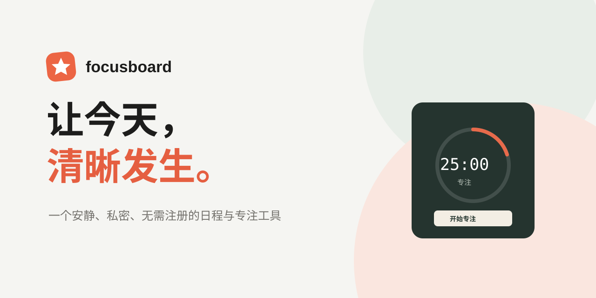

# FocusBoard

<p align="center">
  
</p>

<p align="center">
  一个安静、私密、无需注册的日程与专注工具。<br />
  <a href="#快速开始">快速开始</a> · <a href="#功能">功能</a> · <a href="CONTRIBUTING.md">参与贡献</a> · <a href="docs/ROADMAP.md">路线图</a>
</p>

<p align="center">
  <a href="https://github.com/spectator66/FocusBoard/actions/workflows/ci.yml"></a>
  <a href="LICENSE"></a>
  <a href="https://github.com/spectator66/FocusBoard/stargazers"></a>
</p>

## 为什么是 FocusBoard？

多数规划工具把你推向更多通知、更多设置、更多账户。FocusBoard 反其道而行：打开即用，把今天最重要的事、一个可执行的番茄钟和一份可回看的节奏放在同一个安静界面里。

它是一个 **local-first** 的网页应用：没有账号、没有追踪脚本、没有服务器。你的任务、意图和专注统计默认只存储在浏览器本地。

## 功能

- 今日任务清单：创建、分类、设置优先级、完成或移除任务。
- 专注节奏：25 分钟专注、短休息与长休息模式，完成一轮自动记录。
- 每日意图：用一句话为今天定方向，在忙碌时保持取舍。
- 回顾统计：查看本周专注趋势和累计深度时间。
- 本地掌控：数据保存在 `localStorage`，可一键导出 JSON 备份或恢复示例数据。
- 贴合使用环境：响应式布局、深色模式、键盘友好的原生表单和清晰的交互反馈。

## 快速开始

**在线体验：** 部署后可访问 [GitHub Pages](https://spectator66.github.io/FocusBoard/)。

本地运行需要 [Node.js](https://nodejs.org/) 22 或更高版本：

```bash
git clone https://github.com/spectator66/FocusBoard.git
cd FocusBoard
npm install
npm run dev
```

执行生产构建：

```bash
npm run build
```

## 技术栈

- [React](https://react.dev/)：组件化交互界面
- [Vite](https://vite.dev/)：快速开发和生产构建
- [Lucide](https://lucide.dev/)：一致、可访问的图标
- GitHub Actions：持续构建检查与 GitHub Pages 部署

## 隐私

FocusBoard 不需要账户，也不会把你的数据发送到网络。更多细节见 [隐私说明](docs/PRIVACY.md)。在清除浏览器数据前，请先使用“导出数据”保留备份。

## 贡献

欢迎把 FocusBoard 做得更好。提交问题前请阅读 [行为准则](CODE_OF_CONDUCT.md)，开始开发前请阅读 [贡献指南](CONTRIBUTING.md)。

如果它对你有帮助，欢迎 Star、分享，或提交一个小的改进建议——这对独立开源项目非常重要。

## 路线图

下一阶段包括可导入备份、更灵活的任务排序、无障碍测试和 PWA 离线体验。详见 [项目路线图](docs/ROADMAP.md)。

## 许可证

本项目采用 [MIT License](LICENSE) 开源。
